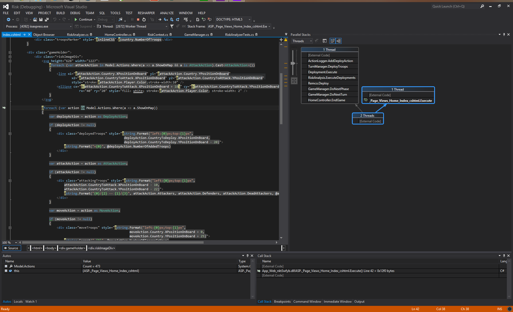

Risk
====

Gemaakte Veranderingen Aan de Game Engine
=========================================

 - De game engine losgetrokken in een apart project, zonder dependencies op de UI / System.Web
 - Singletons uit de game engine verwijderd om de testbaarheid te vergroten
 - GameInformation en TurnManager worden niet meer all-over-the-place ge-newd, in plaats daarvan wordt TurnManager als argument meegeven in de IPlayer api en is GameInformation beschikbaar via de TurnManager api. Hierdoor wordt en een pit-of-success gecreeerd. als men de IPlayer api implementeerd is alles voorhanden wat nodig is voor een succesvolle IPlayer implementatie.
 - Een testproject toegevoegd, met een AllInternalsVisibleTo assembly attribute in Risk.Core
 - Omdat de game engine als een singleton in de applicatie context wordt opgeslagen is deze applicatie niet threadsafe. Het is triviaal mogelijk on de applicatie te laten crashen door te snel op Next Turn te klikken.  Dit kan bijvoorbeeld worden opgelost door de game engine op een eventloop te laten draaien, en d.m.v. commands en futures de communicatie met de uite verzorgen. punt van aandacht: Het Board zoals gebruikt in de UI, zal dan op de eventloop moeten worden opgebouwd als een immutable deep-copy van de staat van de game-engine.

